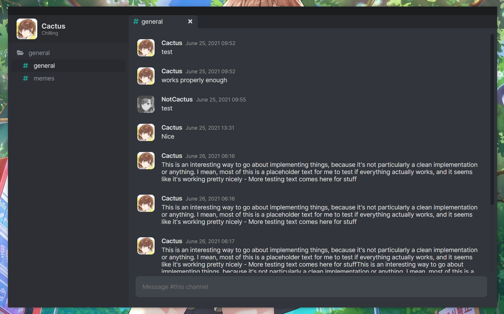

# Multitude Client
A self-hosted chat app inspired by Discord.

## Example



## Prerequisites

You need [hana-id](https://github.com/thecactusblue/hana-id) and [Multitude Server](https://github.com/thecactusblue/multitude-server) both running - also requires PostgreSQL/CockroachDB as dependencies for both. A lot of things are hardcoded for local development as of now: I'll try to fix it later.

## Installation

```bash
yarn install
yarn dev
```

## Packaging
To generate a project package run `package`

```bash
yarn package
```
